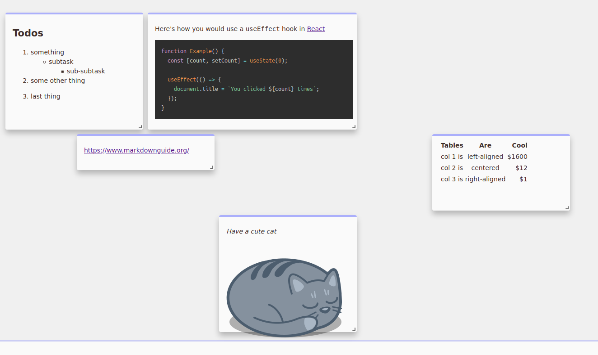

# Spaceboard

### Pinterest for Notes.

**[Try the Demo here!](https://spaceboard.vercel.app/)**

Features:

- full Markdown support
- Saves automatically to IndexedDB/WebSQL/LocalStorage
- free-form rearranging of cards, with automatic tiling/non-overlapping, snaps to grid
- resizable cards
- offline support



## Inspiration

Inspired by [thesephist/thingboard](https://github.com/thesephist/thingboard).

Main differences:

1. people usually don't want to overlap notes, and waste a lot of time rearranging to not overlap
   - bringing to top to focus is not ideal UX
2. Built with React/Next.js :)
3. Support markdown

## Dev

Tech stack: Next.js, React, ThemeUI/Styled-system, TypeScript

```bash
yarn create next-app --example with-typescript
yarn
yarn dev
```

## Todos

- remove elem
- fix annoying entering edit mode whenever moving around a card

- enable tabbing to insert tab in textArea (maybe look into https://www.npmjs.com/package/react-simple-code-editor but really need tabs for bullet lists as well...)

4. drag+drop images/files?
5. eventually support sharing links...

also:

- use `@theme-ui/typography`,`@theme-ui/color` ?

`@theme-ui/prism` didn't work, so had to use `react-syntax-highlighter` instead.

## Deploy your own

Deploy the example using [Vercel](https://vercel.com):

[](https://vercel.com/import/project?template=https://github.com/vercel/next.js/tree/canary/examples/with-typescript)

Deploy it to the cloud with [Vercel](https://vercel.com/import?filter=next.js&utm_source=github&utm_medium=readme&utm_campaign=next-example) ([Documentation](https://nextjs.org/docs/deployment)).
